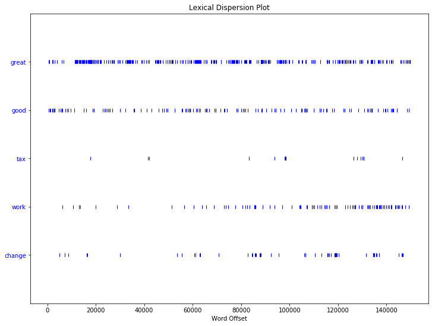

## Lexical Dispersion Plot

Keypoints:
- "Lexical dispersion is a visualisation that allows us to see where a particular term appears across a document or set of documents"
- "We used NLTK's ```dispersion_plot``` ."

We can plot lexical dispersion of particular tokens. Lexical dispersion is a measure of how frequently a word appears across the parts of a corpus. This plot notes the occurrences of a word and how many words from the beginning of the corpus it appears (word offsets). This is particularly useful for a corpus that covers a longer time period and for which you want to analyse how specific terms were used more or less frequently over time.

To create a lexical disperson plot, you will first load and import a different corpus, the inaugural corpus which are all US Presidential Inaugural Addresses and which are provided with NLTK.


```python
nltk.download('inaugural')
from nltk.corpus import inaugural
from nltk.text import Text
inaugural_tokens=inaugural.words()
inaugural_texts = Text(inaugural_tokens)
```

    [nltk_data] Downloading package inaugural to /Users/<USERNAME>/nltk_data...
    [nltk_data]   Package inaugural is already up-to-date!


To create the lexical dispersion plot for this corpus you also need to load ```dispersion_plot``` from the ```nltk.draw.dispersion``` package.  You can then call the ```dispersion_plot``` method given a set of parameters, including the target words you want to plot across the corpus, whether this should be done case-sensitively, and specifying the title of the plot.


```python
from nltk.draw.dispersion import dispersion_plot

plt.figure(figsize=(12, 9)) # command used to increase the size of the plot using width and hight specifications
targets=['great','good','tax','work','change']
dispersion_plot(inaugural_texts, targets)
```


## Task: Create another lexical dispersion plot for this corpus to see how frequently words such as citizens, democracy, freedom, duties, and America appear across the inaugural addresses. 

## Answer:

```python
plt.figure(figsize=(12, 9))
targets=['citizens', 'democracy', 'freedom', 'duties', 'America']
dispersion_plot(inaugural_texts, targets)
```
