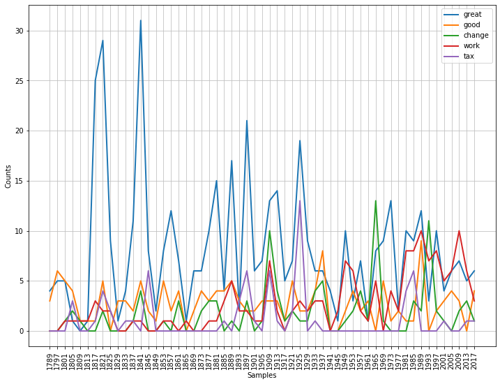

## Plotting Frequency over Time

Keypoints:
- We can extract the terms and the years from the files using NLTK's ```ConditionalFreqDist``` class from the ```nltk.probability``` package.
- We can then plot these on a graph to visualise how the use changes over time.

Similarly to lexical dispersion, you can also plot frequency of terms over time.  This is similarly to the [Google n-gram visualisation](https://books.google.com/ngrams) for the Google Books corpus but we will show you how to do something similar for your own corpus, such as the inaugural corpus.

You first need to import NLTK's ```ConditionalFreqDist``` class from the ```nltk.probability``` package. To generate the graph, you have to specify the list of words to be plotted (see targets) and the x-axis labels, in this case the year the inaugural was held. The numbers for these years appear, fittingly, in the filename for each speech. We ask to see the fileids, the file identifiers in the inaugural corpus:
 	
```python
inaugural.fileids()
```

>['1789-Washington.txt', '1793-Washington.txt', '1797-Adams.txt', ...]

Notice that the year of each inaugural speech appears at the start of each filename. To get the year out of the filename, we extract the first four characters: ```fileid[:4]```.

```
[fileid[:4] for fileid in inaugural.fileids()]
```

>['1789', '1793', '1797', '1801', '1805', '1809', '1813', '1817', '1821', ...]

The plot is created by:
* looping through each file (speech)
* then looping through each word in each speech
* then looping through the list of specified target words and
* checking if each target word matches the start of each word in the speeches (after being lower-cased).

The ```ConditionalFreqDist object``` (```cfd```) stores the number of times each of the target words appear in the each of the speaches and the ```plot()``` method is used to visualise the graph.


```python
from nltk.probability import ConditionalFreqDist

# type this to set the figure size
plt.rcParams["figure.figsize"] = (12, 9)

targets=['great','good','tax','work','change', 'wom[ae]n']

cfd = nltk.ConditionalFreqDist((target, fileid[:4])
    for fileid in inaugural.fileids()
    for word in inaugural.words(fileid)
    for target in targets
    if word.lower().startswith(target))
cfd.plot()
```


> ## Task 1: See how the plot changes when choosing different target words.
> > ## Answer
> >
> > ~~~python
> > plt.rcParams["figure.figsize"] = (12, 9)
> > targets=['god','work']
> > cfd = nltk.ConditionalFreqDist((target, fileid[:4])
> > 	for fileid in inaugural.fileids()
> > 	for word in inaugural.words(fileid)
> >    	for target in targets
> >     if word.lower().startswith(target))
> > cfd.plot()
> > ~~~
> >
    
> ## Task 2: See how the plot changes when choosing different target words.
> > ## Answer
> > ~~~python
> > plt.rcParams["figure.figsize"] = (12, 9)
> > targets=['men', 'women']
> > cfd = nltk.ConditionalFreqDist((target, fileid[:4])
> >     for fileid in inaugural.fileids()
> >     for word in inaugural.words(fileid)
> >     for target in targets
> >     if word.lower().startswith(target))
> > cfd.plot()
> > ~~~
> >
[Index](https://ang-uio.github.io/Textmining/) or  
[next](https://ang-uio.github.io/Textmining/episodes/12-collocations.html)
